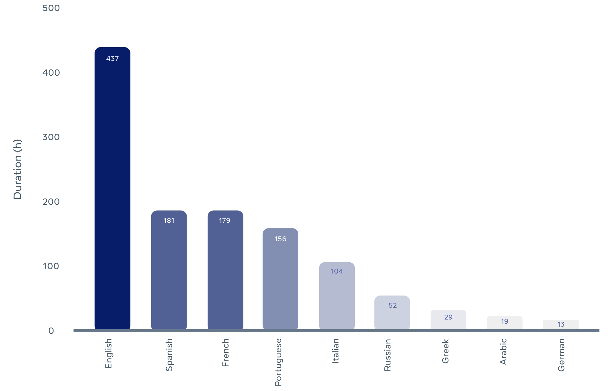

MuAViC
=====

[https://arxiv.org/abs/2303.00628](https://arxiv.org/abs/2303.00628)

A Multilingual Audio-Visual Corpus for Robust Speech Recognition and Robust Speech-to-Text Translation.

# Overview

MuAViC provides
- 1200 hours of transcribed audio-visual speech for 9 languages (English, Arabic, German, Greek,
Spanish, French, Italian, Portuguese and Russian)
- text translations for 6 English-to-X directions and 6 X-to-English directions (X = Greek,
Spanish, French, Italian, Portuguese or Russian)

<div align="left">
    
</div>

The raw data is collected from TED/TEDx talk recordings.

#### Detailed statistics

<details><summary>Audio-Visual Speech Recognition</summary><p>

| Language | Code | Train Hours (H+P) | Train Speakers |
|:---:|:---:|:---:|:---:|
| English | En |  436 + 0 | 4.7K |
| Arabic | Ar |  16 + 0 | 95 |
| German | De |  10 + 0 | 53 |
| Greek | El | 25 + 0 | 113 |
| Spanish | Es | 178 + 0 | 987 |
| French | Fr |  176 + 0 | 948 |
| Italian | It |  101 + 0 | 487 |
| Portuguese | Pt | 153 + 0 | 810 |
| Russian | Ru | 49 + 0 | 238 |

</p></details>


<details><summary>Audio-Visual En-X Speech-to-Text Translation</summary><p>

| Direction | Code | Train Hours (H+P) | Train Speakers |
|:---:|:---:|:---:|:---:|
| English-Greek | En-El | 17 + 420 | 4.7K |
| English-Spanish | En-Es | 21 + 416 | 4.7K |
| English-French | En-Fr |  21 + 416 | 4.7K |
| English-Italian | En-It |  20 + 417 | 4.7K |
| English-Portuguese | En-Pt | 18 + 419 | 4.7K |
| English-Russian | En-Ru | 20 + 417 | 4.7K |

</p></details>


<details><summary>Audio-Visual X-En Speech-to-Text Translation</summary><p>

| Direction | Code | Train Hours (H+P) | Train Speakers |
|:---:|:---:|:---:|:---:|
| Greek-English | El-En |  8 + 17 | 113 |
| Spanish-English | Es-En |  64 + 114 | 987 |
| French-English | Fr-En |  45 + 131 | 948 |
| Italian-English | It-En |  48 + 53 | 487 |
| Portuguese-English | Pt-En | 53 + 100 | 810 |
| Russian-English | Ru-En | 8 + 41 | 238 |

</p></details>


# Getting Data

We provide scripts to generate the audio/video data and AV-HuBERT training manifests for MuAViC.

As the first step, clone this repo for the scripts
```bash
git clone https://github.com/facebookresearch/muavic.git
```
and install required packages:
```bash
conda install -c conda-forge ffmpeg==4.2.2
pip install -r requirements.txt
```

Then get audio-visual speech recognition and translation data via

```bash
python get_data.py --root-path ${ROOT} --src-lang ${SRC_LANG}
```
where the speech language `${SRC_LANG}` is one of `en`, `ar`, `de`, `el`, `es`, `fr`, `it`, `pt` and `ru`.

Generated data will be saved to `${ROOT}`:
- `${ROOT}/muavic/*.tsv` for AV-HuBERT training manifests
- `${ROOT}/muavic/audio` for processed audio files
- `${ROOT}/muavic/video` for processed video files


# License

CC-BY-NC 4.0


# Citation

```bibtex
@article{anwar2023muavic,
  title={MuAViC: A Multilingual Audio-Visual Corpus for Robust Speech Recognition and Robust Speech-to-Text Translation},
  author={Anwar, Mohamed and Shi, Bowen and Goswami, Vedanuj and Hsu, Wei-Ning and Pino, Juan and Wang, Changhan},
  journal={arXiv preprint arXiv:2303.00628},
  year={2023}
}
```
